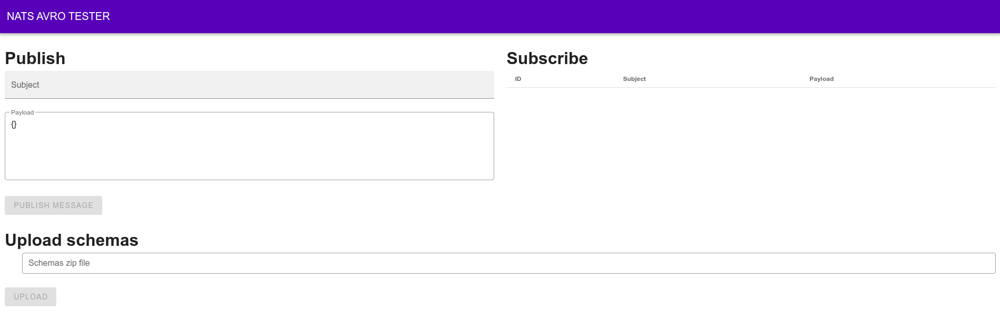

# NATS AVRO TESTER
> TODO

## Stack
- golang 1.14
- vuejs
- docker
- nats
- lib for decoding/encoding avro schema

## Web UI


## Why?
TODO

## How to develop?
> At the moment there is no possibility to develop frontend part without backend part.
>
> All requests from frontend are sent to same domain `window.location.origin`.
>
> Just run both Backend and Frontend using instructions below.

### Backend
ENV:
- PORT (default: 8080)
- NATS_SERVER (default: http://localhost:4222)
- [MAX_HIERARCHY_LEVEL](https://docs.nats.io/nats-concepts/subjects#subject-hierarchies) (default: 1)
- [LOG_LEVEL](https://github.com/rs/zerolog/blob/master/log.go#L134) (default: trace)

In the root of the project directory:
```shell script
go run .
```
You'll get web server (http://localhost:8080 by default) which hosts static assets (`web/dist`) from Frontend part.

### Frontend
In the root of the project directory:
```shell script
(cd web && npm run dev)
```
It will keep up to date app assets inside `web/dist`.
