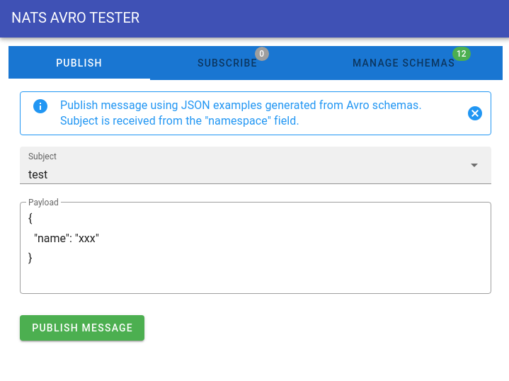

# NATS AVRO TESTER

## Disclaimer

**This project has been created for own needs and may contain bugs.**

**Tests are also missing. :(**

**Use it carefully on your own risk!**

## Stack
- golang 1.14
- vuejs
- docker
- nats
- lib for decoding/encoding Avro schemas

## Features
- uploading your zipped [Avro](https://avro.apache.org) schemas
- auto discovering list of subjects using "namespace" from Avro schemas
- publishing messages (auto encode to Avro)
- receiving any messages from all subjects
- auto decoding messages using Avro schemas

## TODO
- better documentation
- support publishing into JSON format
- support publishing to custom subject
- tests
- refactoring
- improve UI

## Web UI


## See working example
```shell script
docker-compose up
```

## Want to use in your own project?
Just use [image](https://hub.docker.com/repository/docker/jilexandr/natsavrotester) from Docker Hub
### Configuration example
```yaml
version: "3"
services:
  app:
    image: jilexandr/natsavrotester:1.1.2
    environment:
      PORT: 8080
      NATS_SERVER: "http://nats:4222"
      MAX_HIERARCHY_LEVEL: 5
      LOG_LEVEL: "trace"
    ports:
      - 9999:8080
    links:
      - nats
  nats:
    image: nats:2.1
    ports:
      - 4222
```

## How to develop?
> At the moment there is no possibility to develop frontend part without backend part.
>
> All requests from frontend are sent to same domain `window.location.origin`.
>
> Just run both Backend and Frontend using instructions below.

### Backend
ENV:
- PORT (default: 8080)
- NATS_SERVER (default: http://localhost:4222)
- [MAX_HIERARCHY_LEVEL](https://docs.nats.io/nats-concepts/subjects#subject-hierarchies) (default: 1)
- [LOG_LEVEL](https://github.com/rs/zerolog/blob/master/log.go#L134) (default: trace)

In the root of the project directory:
```shell script
go run .
```
You'll get web server (http://localhost:8080 by default) which hosts static assets (`web/dist`) from Frontend part.

### Frontend
In the root of the project directory:
```shell script
(cd web && npm run dev)
```
It will keep up to date app assets inside `web/dist`.
